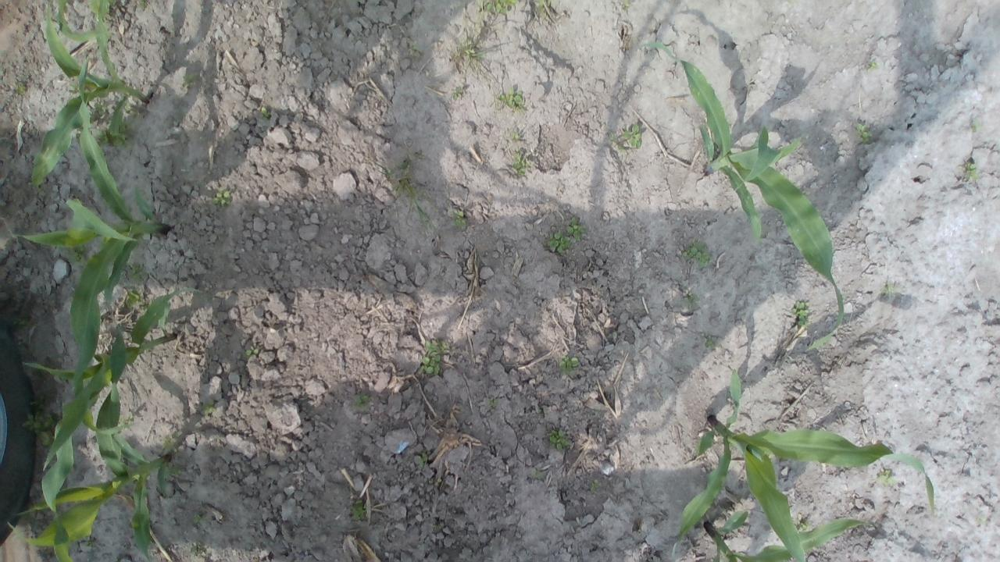
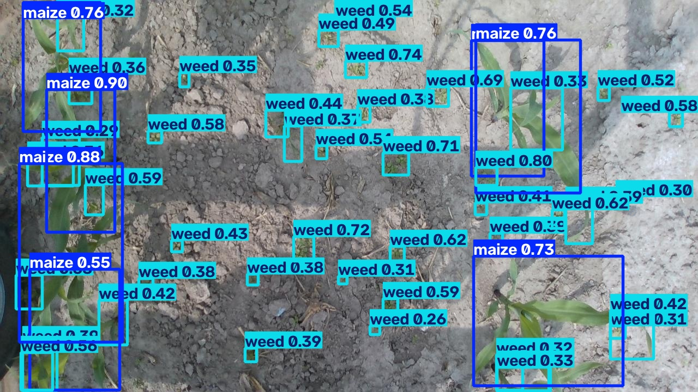

# Synthetic-to-Real Agricultural Crop-Weed Detection

Train a YOLO object detector on **procedurally generated synthetic agricultural imagery** (AgriVerse) to detect maize and weeds, then measure how well it transfers to the **real-world CornWeed field dataset** by quantifying the synthetic-to-real domain gap.

---

## Sample Synthetic Data

<p align="center">


</p>

<p align="center">
<sub>
Sample AgriVerse synthetic renders from training, validation, and testing splits.
</sub>
</p>

---

# Motivation

Collecting and labeling real agricultural imagery for crop and weed detection is slow and expensive.

Procedurally generated synthetic data provides:

- Large-scale image generation
- Exact bounding-box annotations
- Controlled variation in plant morphology, lighting, and environment

However, models trained only on synthetic data often lose accuracy when deployed on real field images due to the **synthetic-to-real domain gap**.

This gap comes from differences in:

- Plant textures
- Lighting conditions
- Camera sensor noise
- Background complexity
- Soil and environmental appearance

This project trains a detector using synthetic data only, evaluates it on both synthetic and real-world images, and measures how performance changes during transfer.

---

# Pipeline

```
┌─────────────────────────────────────┐
│ AgriVerse Synthetic Dataset          │
│                                     │
│ - Procedural crop/weed generation    │
│ - Automatic YOLO annotations         │
└──────────────────┬──────────────────┘
                   │
                   ▼
┌─────────────────────────────────────┐
│ YOLOv8 Crop-Weed Detector Training   │
│                                     │
│ - Train only on synthetic images     │
│ - Learn maize and weed detection     │
└──────────────────┬──────────────────┘
                   │
                   ▼
┌─────────────────────────────────────┐
│ Synthetic Test Evaluation            │
│                                     │
│ - Held-out AgriVerse images          │
│ - In-domain performance analysis     │
└──────────────────┬──────────────────┘
                   │
                   ▼
┌─────────────────────────────────────┐
│ Real CornWeed Field Evaluation       │
│                                     │
│ - Unseen real-world images           │
│ - Out-of-domain transfer testing     │
└──────────────────┬──────────────────┘
                   │
                   ▼
┌─────────────────────────────────────┐
│ Synthetic-to-Real Domain Gap         │
│                                     │
│ - Precision                          │
│ - Recall                             │
│ - F1-score                           │
│ - mAP50 / mAP50-95                   │
└─────────────────────────────────────┘
```

---

# Dataset

## AgriVerse Synthetic Dataset

The AgriVerse synthetic sample contains:

- **150 images**
- 120 training images
- 15 validation images
- 15 testing images

Images are:

- 1024×1024 RGB top-down agricultural renders
- Automatically annotated in YOLO format
- Two classes:
  - `maize`
  - `weed`

Plant morphology, placement, soil appearance, and lighting are procedurally generated and randomized.

| Split | Images | Maize Boxes | Weed Boxes |
|---|---:|---:|---:|
| Train | 120 | 1,023 | 5,082 |
| Validation | 15 | 124 | 633 |
| Test | 15 | 127 | 610 |

The dataset contains approximately a **5:1 weed-to-maize imbalance**.

Evaluation reports both:

- Overall performance
- Per-class performance

This repository contains a preview sample of a larger 6,500-image AgriVerse dataset.

Dataset license: **CC BY 4.0**

Reference:

> Esfandiyar, I., Moroz, I., Plaskowski, D., Gawron, T.  
> "Sim-to-Real Transferability of Deep Learning-Based Weed and Crop Detection Models Trained on Procedurally Generated Agricultural Simulation Data."

---

# Real Dataset: CornWeed (Weed-AI)

The CornWeed dataset is used only for **out-of-domain testing**.

The model never sees these images during training.

Dataset characteristics:

- 3,574 real-world RGB field images
- Bounding-box annotations
- COCO and YOLO formats available
- Classes:
  - maize
  - weed

Statistics:

| Dataset | Images | Maize Instances | Weed Instances |
|---|---:|---:|---:|
| CornWeed Test | 3,574 | 23,985 | 257,740 |

The real dataset has a stronger imbalance:

- Synthetic dataset: ~5:1 weed:maize
- CornWeed dataset: ~10.7:1 weed:maize

Annotations are converted into YOLO format using:

```
scripts/convert_cornweed.py
```

Reference:

> Iqbal, N., Manss, C., Scholz, C., König, D., Igelbrink, M., Ruckelshausen, A.  
> "AI-Based Maize and Weeds Detection on the Edge with CornWeed Dataset."  
> FedCSIS 2023.

---

# Tech Stack

| Category | Tools |
|---|---|
| Programming | Python |
| Development | VS Code, PowerShell, Git, GitHub |
| Computer Vision | OpenCV, Pillow |
| Deep Learning | YOLOv8, PyTorch |
| Data Processing | NumPy, Pandas, scikit-learn |
| Visualization | Matplotlib, Seaborn |
| Deployment (optional) | Docker, ROS 2 |

---

# Repository Structure

```
├── assets/
│   └── sample_images/
│       ├── train_sample_01.png
│       ├── val_sample_01.png
│       ├── test_sample_01.png
│       ├── real_sample_01.png
│       └── real_prediction_01.png
│
├── configs/
│   ├── agriverse_synthetic.yaml
│   └── real_target.yaml
│
├── src/
│   ├── data_prep.py
│   ├── visualize_dataset.py
│   ├── train.py
│   ├── evaluate.py
│   └── domain_gap_analysis.py
│
├── scripts/
│   ├── setup_env.ps1
│   └── convert_cornweed.py
│
├── results/
├── runs/
├── requirements.txt
└── README.md
```

---

# Setup

```powershell
git clone <repository-url>

cd agriverse-synreal-cropweed

.\scripts\setup_env.ps1
```

Alternative:

```powershell
python -m venv .venv

pip install -r requirements.txt
```

---

# Dataset Validation

Check dataset structure:

```powershell
python src/data_prep.py --data configs/agriverse_synthetic.yaml
```

Visualize annotations:

```powershell
python src/visualize_dataset.py `
--data configs/agriverse_synthetic.yaml `
--split train `
--n 6
```

---

# Training

YOLOv8n is trained only on synthetic AgriVerse images.

CornWeed is never used during training.

```powershell
python src/train.py `
--data configs/agriverse_synthetic.yaml `
--model yolov8n.pt `
--epochs 100 `
--imgsz 1024 `
--batch 8 `
--name agriverse_synthetic_yolov8n
```

---

# Evaluation

## Synthetic Test Evaluation

```powershell
python src/evaluate.py `
--weights runs/detect/agriverse_synthetic_yolov8n/weights/best.pt `
--data configs/agriverse_synthetic.yaml `
--split test `
--tag synthetic_test
```

## Real CornWeed Evaluation

```powershell
python src/evaluate.py `
--weights runs/detect/agriverse_synthetic_yolov8n/weights/best.pt `
--data configs/real_target.yaml `
--split test `
--tag real_test
```

## Domain Gap Analysis

```powershell
python src/domain_gap_analysis.py `
--csv results/metrics/eval_results.csv `
--synthetic_tag synthetic_test `
--real_tag real_test
```

---

# Results

YOLOv8n trained only on synthetic AgriVerse data:

| Evaluation Set | Precision | Recall | F1 | mAP50 | mAP50-95 |
|---|---:|---:|---:|---:|---:|
| Synthetic Test | 0.811 | 0.551 | 0.656 | 0.584 | 0.416 |
| Real CornWeed | 0.485 | 0.446 | 0.464 | 0.372 | 0.124 |

---

# Domain Gap Analysis

| Metric | Synthetic | Real | Relative Drop |
|---|---:|---:|---:|
| Precision | 0.811 | 0.485 | 40.2% |
| Recall | 0.551 | 0.446 | 19.1% |
| F1 | 0.656 | 0.464 | 29.3% |
| mAP50 | 0.584 | 0.372 | 36.3% |
| mAP50-95 | 0.416 | 0.124 | 70.2% |

The largest degradation occurs in **mAP50-95**, indicating that localization quality is affected more than object recognition.

The detector still recognizes crops and weeds reasonably well, but bounding-box precision decreases on real images.

Possible causes:

- Different plant textures
- Real camera noise
- Lighting mismatch
- More complex field backgrounds
- Synthetic-to-real edge differences

---

# Qualitative Prediction Example

<p align="center">




</p>

Left: Original CornWeed image  
Right: YOLOv8 prediction after synthetic-only training

---

# Future Work

- [x] Train YOLOv8 baseline on synthetic data
- [x] Evaluate synthetic-to-real transfer
- [x] Analyze domain gap

Future improvements:

- Stronger synthetic augmentation
- Better domain randomization
- Fine-tuning with limited real data
- Larger YOLO models
- Class-balanced training
- ROS 2 deployment for agricultural robotics

---

# License

Code:
MIT License

Datasets:

- AgriVerse synthetic data: CC BY 4.0
- CornWeed dataset: CC BY 4.0

Please cite the original dataset publications when using the data.