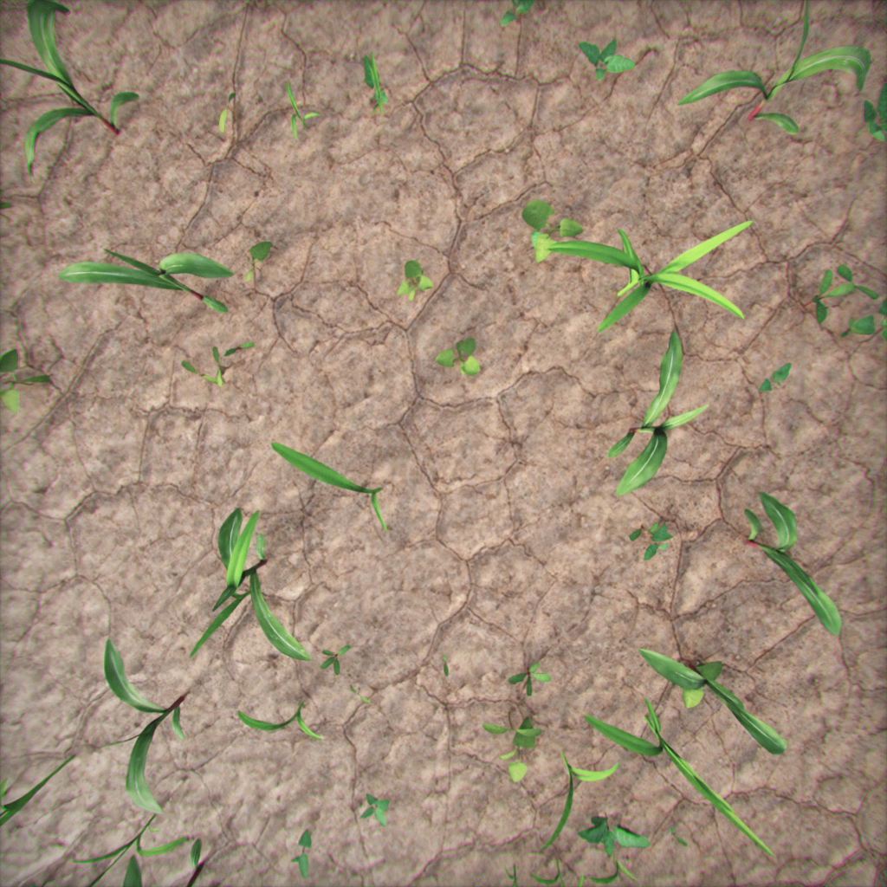
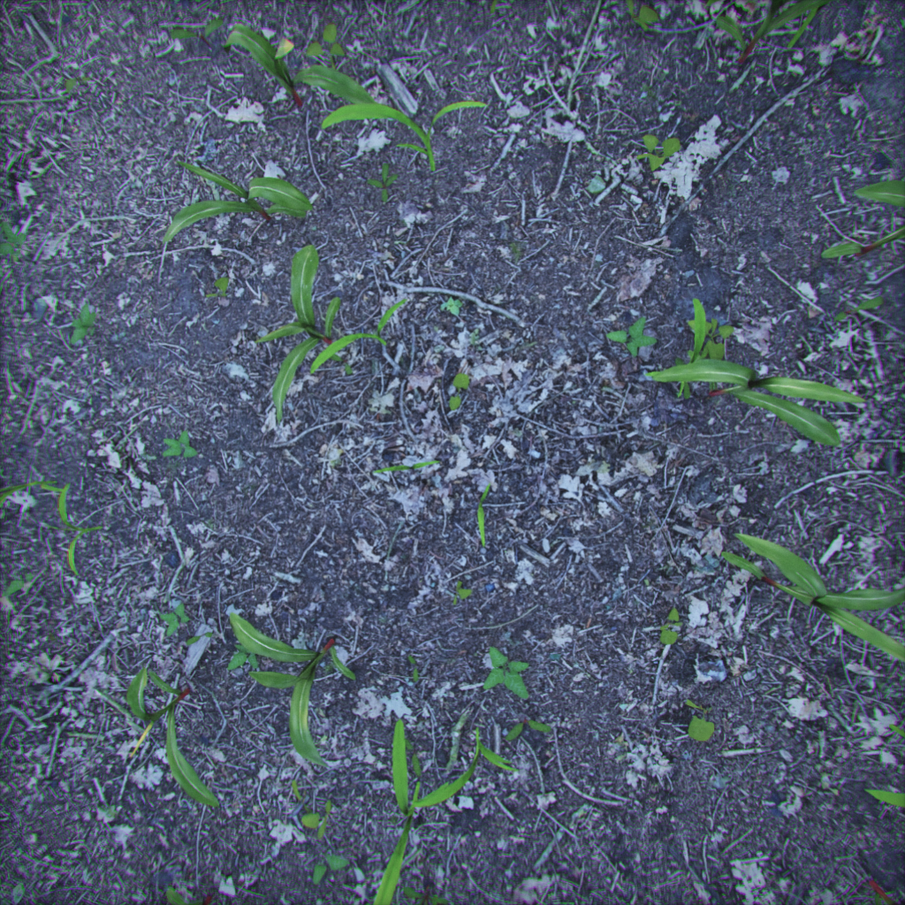
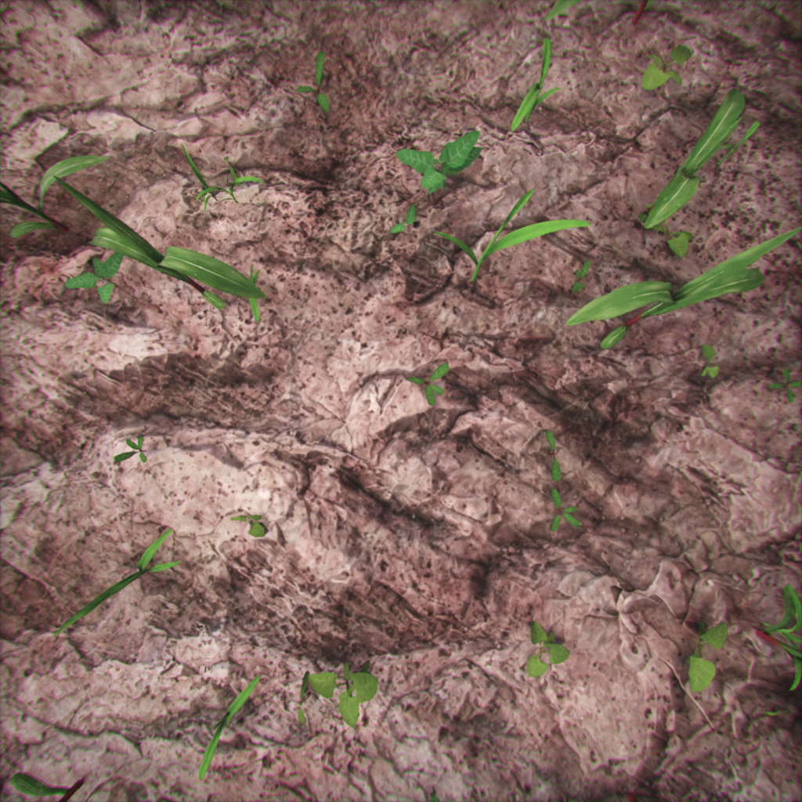

\# Synthetic-to-Real Agricultural Crop-Weed Detection


Train a YOLO object detector on \*\*procedurally generated synthetic

agricultural imagery\*\* (AgriVerse) to detect maize and weeds, then measure

how well it transfers to the \*\*real-world CornWeed field dataset\*\* —

quantifying the synthetic-to-real domain gap.


<p align="center">
  
  
  
</p>

<p align="center">
<sub>
Sample synthetic AgriVerse renders from training, validation and testing splits.
</sub>
</p>

\## Motivation


Collecting and labeling real agricultural imagery for crop/weed detection is

slow and expensive. Procedurally generated synthetic data offers exact,

cost-free bounding-box labels at scale — but models trained purely on

synthetic renders often lose accuracy when deployed on real images, due to

the \*\*domain gap\*\* (differences in texture, lighting, sensor noise, and

scene composition between simulation and reality).


This project trains a detector on synthetic data only, evaluates it

in-domain (on held-out synthetic images) and out-of-domain (on real field

images), and quantifies the gap — a first step toward the kind of

field-deployable, sim-trained perception systems used in agricultural

robotics.


\## Pipeline


```

AgriVerse synthetic data

&#x20;       │

&#x20;       ▼

YOLOv8 crop/weed detector  ──►  Training  ──►  Validation (synthetic)

&#x20;       │

&#x20;       ▼

Testing on CornWeed real field images (never seen in training)

&#x20;       │

&#x20;       ▼

Performance evaluation (mAP, precision, recall, F1)

&#x20;       │

&#x20;       ▼

Synthetic-to-real domain-gap analysis

```


\## Dataset


\*\*AgriVerse synthetic sample\*\* (150 images, 120 train / 15 val / 15 test),

1024x1024 top-down RGB renders with exact YOLO-format bounding boxes for

two classes: `maize` and `weed`. Fully procedural — plant morphology,

count, placement, soil, and lighting are domain-randomized, and labels are

derived directly from scene geometry.


| split | images | maize boxes | weed boxes |

|-------|-------:|------------:|-----------:|

| train | 120    | 1,023       | 5,082      |

| val   | 15     | 124         | 633        |

| test  | 15     | 127         | 610        |


Note the \~5:1 weed:maize imbalance — evaluation is reported per-class as

well as aggregate for this reason.


This is a preview sample of a larger 6,500-image dataset. The full dataset

and pretrained weights are available from the original authors on

reasonable request (see `data/AgriVerse\_synthetic\_sample/README.md`).

Released under CC BY 4.0 — cite:


> Esfandiyar, I., Moroz, I., Plaskowski, D., Gawron, T. \*"Sim-to-Real

> Transferability of Deep Learning-Based Weed and Crop Detection Models

> Trained on Procedurally Generated Agricultural Simulation Data."\*

> (under review, \*Ecological Informatics\*)


The real-world evaluation set is \*\*not included\*\* — see

\[`scripts/prepare\_real\_dataset.md`](scripts/prepare\_real\_dataset.md) for

how to source and format one.


\### Real dataset: CornWeed (Weed-AI)


Used for out-of-domain testing only — \*\*never seen during training\*\*.


\- 3,574 hand-labelled RGB maize/weed field images

\- Bounding-box annotations, available in both COCO and YOLO formats

\- Same two classes (`maize`, `weed`)

\- Source: \[Weed-AI dataset page](https://weed-ai.sydney.edu.au/datasets/aec20fe7-f607-4a4c-aca5-d0f19c7c755f)

\- License: CC BY 4.0


Dataset statistics (via `src/data\_prep.py`):


| | Images | Maize instances | Weed instances |

|---|---:|---:|---:|

| CornWeed (test) | 3,574 | 23,985 | 257,740 |


The weed:maize imbalance is even more pronounced here (\~10.7:1) than in

the synthetic training set (\~5:1) — worth keeping in mind when comparing

per-class results below.


Converted from COCO to this project's YOLO layout with

\[`scripts/convert\_cornweed.py`](scripts/convert\_cornweed.py), preserving

the class mapping (`0: maize`, `1: weed`); point `configs/real\_target.yaml`

at the converted output.


Cite:


> Iqbal, N., Manss, C., Scholz, C., König, D., Igelbrink, M.,

> Ruckelshausen, A. \*"AI-Based Maize and Weeds Detection on the Edge with

> CornWeed Dataset."\* 2023 18th Conference on Computer Science and

> Intelligence Systems (FedCSIS). DOI: \[10.15439/2023F2125](https://doi.org/10.15439/2023F2125)


\## Tech stack


| Category | Tools |

|---|---|

| Language / tooling | Python, VS Code, PowerShell, Git + GitHub |

| Computer vision | OpenCV, Pillow |

| Detection / deep learning | Ultralytics YOLO, PyTorch |

| Data / numerics | NumPy, Pandas, scikit-learn |

| Visualization \& metrics | Matplotlib, Seaborn, mAP / Precision / Recall / F1 |

| Optional | Weights \& Biases (experiment tracking), Docker, ROS 2 (robotic deployment) |


\## Repository layout


```

├── configs/                    # YOLO dataset yamls (synthetic + real target)

├── data/                       # datasets live here locally (git-ignored, see data/README.md)

├── assets/sample\_images/       # a few demo frames committed for the README

├── src/

│   ├── data\_prep.py            # dataset sanity check + class-balance report

│   ├── visualize\_dataset.py    # draws GT boxes on sample images

│   ├── train.py                # fine-tunes YOLO on synthetic data

│   ├── evaluate.py             # computes mAP/P/R/F1 on a given split

│   ├── domain\_gap\_analysis.py  # compares synthetic vs. real eval results

│   └── utils.py

├── scripts/

│   ├── setup\_env.ps1           # Windows/PowerShell environment setup

│   ├── prepare\_real\_dataset.md # sourcing/converting a real target dataset

│   └── convert\_cornweed.py     # COCO → YOLO converter for CornWeed

├── results/                    # metrics CSVs + figures land here (git-ignored contents)

├── runs/                       # Ultralytics training/eval runs + weights (git-ignored)

└── requirements.txt

```


\## Setup


```powershell

git clone <this-repo-url>

cd AgriVerse-SynReal-CropWeed

.\\scripts\\setup\_env.ps1

```


(or, cross-platform: `python -m venv .venv \&\& pip install -r requirements.txt`)


Then restore the dataset into `data/AgriVerse\_synthetic\_sample/` as

described in \[`data/README.md`](data/README.md).


\## Usage


```powershell

\# 1. Sanity-check the dataset and class balance

python src/data\_prep.py --data configs/agriverse\_synthetic.yaml


\# 2. Visualize sample annotations

python src/visualize\_dataset.py --data configs/agriverse\_synthetic.yaml --split train --n 6

```


\## Training


YOLOv8n is trained only on the AgriVerse synthetic dataset — CornWeed is

never seen during training, only used for evaluation below.


```powershell

python src/train.py `

&#x20;   --data configs/agriverse\_synthetic.yaml `

&#x20;   --model yolov8n.pt `

&#x20;   --epochs 100 `

&#x20;   --imgsz 1024 `

&#x20;   --batch 8 `

&#x20;   --name agriverse\_synthetic\_yolov8n

```


\## Evaluation


The detector is trained \*\*exclusively on procedurally generated AgriVerse

synthetic imagery\*\* and evaluated on two datasets:


\- \*\*Synthetic test set (in-domain evaluation):\*\* held-out AgriVerse images

&#x20; not seen during training.

\- \*\*CornWeed real-world test set (out-of-domain evaluation):\*\* unseen field

&#x20; images used to measure synthetic-to-real transfer.


This comparison quantifies the synthetic-to-real domain gap by measuring

how detection performance changes when the model is applied to real

agricultural imagery.


```powershell

\# In-domain: synthetic test split

python src/evaluate.py `

&#x20;   --weights runs/detect/agriverse\_synthetic\_yolov8n/weights/best.pt `

&#x20;   --data configs/agriverse\_synthetic.yaml --split test --tag synthetic\_test


\# Out-of-domain: same weights on CornWeed (see scripts/prepare\_real\_dataset.md)

python src/evaluate.py `

&#x20;   --weights runs/detect/agriverse\_synthetic\_yolov8n/weights/best.pt `

&#x20;   --data configs/real\_target.yaml --split test --tag real\_test


\# Quantify the domain gap

python src/domain\_gap\_analysis.py `

&#x20;   --csv results/metrics/eval\_results.csv `

&#x20;   --synthetic\_tag synthetic\_test --real\_tag real\_test

```


\## Results


YOLOv8n, trained on synthetic AgriVerse data only, evaluated on held-out

synthetic images and on the real-world CornWeed test set:


| Eval set | Precision | Recall | F1 | mAP50 | mAP50-95 |

|---|---:|---:|---:|---:|---:|

| Synthetic test | 0.811 | 0.551 | 0.656 | 0.584 | 0.416 |

| Real CornWeed test | 0.485 | 0.446 | 0.464 | 0.372 | 0.124 |


!\[Synthetic-to-real domain gap](results/figures/domain\_gap.png)


\### Qualitative example: CornWeed prediction


<p align="center">

&#x20; 

&#x20; 

</p>

<p align="center"><sub>Left: original CornWeed field image. Right: YOLOv8 prediction after training only on AgriVerse synthetic imagery.</sub></p>


\### Per-class AP50


| Class | Synthetic test | Real CornWeed test |

|---|---:|---:|

| Maize | 0.596 | 0.347 |

| Weed | 0.571 | 0.397 |


Both classes lose roughly 0.20–0.25 AP50 points moving from synthetic to

real, with maize dropping slightly more (0.249) than weed (0.174) —

consistent with maize being the rarer class in synthetic training

(\~5:1 weed:maize) while CornWeed's real-world imbalance runs even more

weed-heavy (\~10.7:1), so maize gets comparatively less real-distribution

signal either way.


\### Domain gap


| Metric | Synthetic | Real | Absolute drop | Relative drop |

|---|---:|---:|---:|---:|

| Precision | 0.811 | 0.485 | 0.326 | 40.2% |

| Recall | 0.551 | 0.446 | 0.105 | 19.1% |

| F1 | 0.656 | 0.464 | 0.192 | 29.3% |

| mAP50 | 0.584 | 0.372 | 0.212 | 36.3% |

| mAP50-95 | 0.416 | 0.124 | 0.292 | 70.2% |


mAP50-95 shows by far the largest relative drop (70%), much steeper than

mAP50 (36%). Since mAP50-95 averages over stricter IoU thresholds, this

points to a \*\*localization problem more than a classification problem\*\*:

this indicates that the detector retains some object recognition

capability on real images (recall only drops 19%), but its box boundaries

are noticeably looser than on synthetic renders — consistent with the

synthetic soil/lighting/plant-edge appearance not matching real field

conditions closely enough for tight boxes to transfer.


Possible causes:


\- different plant textures between rendered and real leaves

\- different lighting conditions (synthetic lighting is domain-randomized

&#x20; but not camera-matched)

\- real camera sensor noise absent from clean renders

\- more complex, cluttered real field backgrounds (residue, shadows, soil

&#x20; variation) vs. simplified synthetic soil

\- systematic synthetic-to-real boundary/edge mismatch at object contours


\*(Per-class AP50 for maize vs. weed is broken out above; both `evaluate.py`

runs also log it to `results/metrics/eval\_results.csv` for future

comparisons.)\*


\## Status / next steps


\- \[x] Train baseline YOLOv8n on the synthetic sample

\- \[x] Source and format the CornWeed real-world test set

\- \[x] Run the synthetic-to-real domain-gap evaluation

\- \[x] Break down the gap per-class (maize vs. weed)

\- \[ ] Investigate the localization-heavy gap (mAP50-95 drop far exceeds

&#x20;     mAP50 drop) — try stronger geometric/appearance augmentation during

&#x20;     synthetic training to see if it tightens real-image boxes

\- \[ ] Try light domain-randomization or augmentation ablations to see what

&#x20;     narrows the gap

\- \[ ] Fine-tune the synthetic-trained model on a small amount of labeled

&#x20;     real CornWeed images and re-measure the gap

\- \[ ] Compare larger YOLO variants (YOLOv8s/m/l) against the YOLOv8n baseline

\- \[ ] Investigate class-balanced sampling or weighted losses for the

&#x20;     maize/weed imbalance (worse in CornWeed, \~10.7:1, than in synthetic

&#x20;     training, \~5:1)

\- \[ ] Request the full 6,500-image AgriVerse set / pretrained weights and

&#x20;     re-run — 120 synthetic training images is a small baseline

\- \[ ] Optional: package inference as a small ROS 2 node for a

&#x20;     field-deployable perception demo


\## License


Code in this repository: MIT (see `LICENSE`).

`data/AgriVerse\_synthetic\_sample/` retains its original CC BY 4.0 license —

see `data/AgriVerse\_synthetic\_sample/LICENSE.txt` and cite the associated

publication above if you use it. The CornWeed dataset (Weed-AI) is also

CC BY 4.0 — cite Iqbal et al. (2023) 

